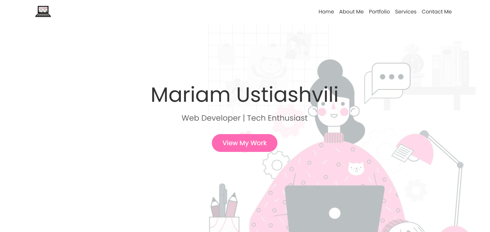

# Portfolio Website

Welcome to my personal portfolio website! This project showcases my skills, projects, and services as a Developer. The website is built using HTML, CSS, JavaScript, and Bootstrap, with additional animations powered by AOS.



## Features

- **Responsive Design**: The website is fully responsive and works seamlessly on all devices.
- **Smooth Scrolling**: Smooth scrolling for anchor links with an offset for the fixed header.
- **Interactive Portfolio**: Showcase of my projects with links to their GitHub repositories.
- **Contact Form**: A simple contact form with basic validation.

## Technologies Used

- **HTML5**: For structuring the content.
- **CSS3**: For styling the website, including custom animations and responsive design.
- **JavaScript**: For interactive elements like smooth scrolling, form validation, and dynamic navigation.
- **Bootstrap 5**: For responsive layout and pre-built components.
- **Google Fonts**: Using the Poppins font for a modern look.

## Installation

1. Clone the repository:
```bash
git clone https://github.com/Ustachkaa/Portfolio_Responsive_Web_Design.git
```

2. Navigate to the project directory:
```bash
cd Portfolio_Responsive_Web_Design
```

3. Open `index.html` in your browser to view the website.


## Project Structure
```bash
portfolio-website/
│
├── index.html          # Main HTML file
├── styles.css          # Custom CSS styles
├── script.js           # JavaScript for interactivity
├── Pictures/           # Folder containing images
│   ├── logo.png        # Logo image
│   ├── Wallpaper.png   # Background image for the home section
│   ├── cards.png       # Image for the D&D project
│   ├── tooltip.png     # Image for the tooltip project
│   ├── Queen.png       # Image for the Queen of Hearts project
│   └── self.png        # Image for the self-portrait project
└── README.md           # This file
```

## Reference
This project was inspired by and uses some design elements from the Responsive Web Design Website by Lime-Light-TechLead. Special thanks to them for providing a great reference!
Check out their project here: [Lime-Light-TechLead on GitHub](https://github.com/Lime-Light-TechLead/Responsive-web-design-Website).